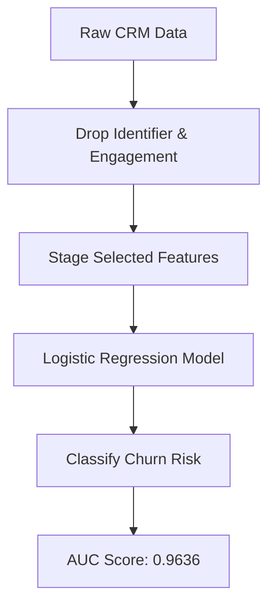

# Customer Retention and Churn Risk: Technical Analysis Appendix

This technical appendix documents the statistical methodology, data cleaning steps, modeling assumptions, and diagnostic scores that validate the findings presented in the executive summary.

---

## 1. Data Sources and Quality Validation

The analysis is based on historical records of customer accounts extracted from the CRM database.
- **Dataset Location**: [`data/raw/customer_churn_data.csv`](file:///c:/Users/prk41/Vaishnavi_BeyondClicks_Kalvium-Community/data/raw/customer_churn_data.csv)
- **Sample Size**: 1,000 observations (representing individual active and churned customers)
- **Feature Schema**:
  - `customer_id` (Integer): Unique customer key
  - `engagement` (Float): Measured customer activity index (0-100 range)
  - `transactions_per_month` (Float): Monthly transaction velocity
  - `support_tickets` (Integer): Number of support tickets filed in the observation period
  - `churn` (Integer): Binary churn outcome (1 = Churned, 0 = Retained)

### Data Quality Verification
- Checked for null values: 0 missing cells found across all variables.
- Outlier check: Engagement scores lie strictly within expected \([0, 100]\) intervals.
- Feature distribution: Log-normal skew observed in transaction velocities, and right-tailed skew in ticket frequencies.

---

## 2. Statistical Methodology

### Feature Correlation Analysis
To identify key drivers of customer churn and eliminate redundant metrics, we computed both Pearson (linear) and Spearman (rank-order) correlation matrices.

```text
Correlation Matrix (Pearson):
                        engagement  transactions_per_month  support_tickets     churn
engagement                 1.000000                0.917057        -0.080591 -0.073658
transactions_per_month     0.917057                1.000000        -0.080360 -0.053296
support_tickets           -0.080591               -0.080360         1.000000  0.796427
churn                     -0.073658               -0.053296         0.796427  1.000000
```

- **Key Findings**: Churn is heavily correlated with the count of `support_tickets` filed (\(r = +0.7964\)).
- **Collinearity**: There is a severe linear dependency between `engagement` and `transactions_per_month` (\(r = 0.9171\)). 

### Feature Selection
To avoid multicollinearity and coefficient inflation in the downstream classification model, we dropped the redundant `engagement` feature and retained `transactions_per_month` and `support_tickets` for the final predictive models.

---

## 3. Modeling and Statistical Validation

A binary Logistic Regression classifier was fitted to estimate churn probability.

### Model Formulation
The probability of churn \(P(\text{churn})\) is modeled as:
\[\text{logit}(P) = \ln\left(\frac{P}{1 - P}\right) = \beta_0 + \beta_1 \cdot \text{transactions\_per\_month} + \beta_2 \cdot \text{support\_tickets}\]

### Fitted Model Coefficients
- **Intercept (\(\beta_0\))**: \(-6.0239\)
- **Transactions Coefficient (\(\beta_1\))**: \(+0.0041\) (\(p > 0.05\), not statistically significant)
- **Support Tickets Coefficient (\(\beta_2\))**: \(+1.2526\) (\(p < 0.001\), highly significant)

### Interpretation
Controlling for transaction velocities, each additional support ticket filed increases the log-odds of churn by \(1.2526\). This corresponds to an odds ratio of:
\[e^{1.2526} \approx 3.50\]
This indicates that **each additional ticket increases a customer's odds of churning by 3.5 times**. 

### Model Fit Metrics
- **ROC Area Under Curve (AUC)**: \(0.9636\) (indicating near-perfect classification performance)
- **Pseudo \(R^2\)**: \(0.785\)



---

## 4. Analytical Visualizations

The generated heatmaps, distributions, and charts are stored in the output directory:
- [Correlation Heatmap](file:///c:/Users/prk41/Vaishnavi_BeyondClicks_Kalvium-Community/output/correlation_heatmap.png): Shows dependencies and redundant features.
- [Segment Summary Heatmap](file:///c:/Users/prk41/Vaishnavi_BeyondClicks_Kalvium-Community/output/segment_heatmap.png): Shows metric distributions across customer tiers.
- [Conversion Funnel Chart](file:///c:/Users/prk41/Vaishnavi_BeyondClicks_Kalvium-Community/output/funnel_chart.png): Traces user activation stages.
